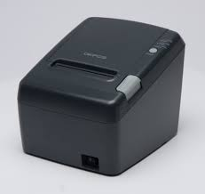

# 빅슬론 
https://kr.bixolon.com

### 가상 포트 드라이버(USB)

[가상 COM 포트 드라이버_V2.5.2 (USB)](download/Software_BXLVCOM4USB_Driver_V2.5.2_한국어.zip)

[가상 LPT 포트 드라이버_V1.2.0 (USB)](download/Software_BXLVLPT4USB_Driver_V1.2.0_한국어.zip)

# 포스뱅크

https://www.posbanksolutions.com/customer-service/support-drivers.html

### 가상 포트 드라이버(USB)

 

[A11 Prime COM->USB](download/POSBANK%20VCOM4USB%20Driver_V1.0.2.zip)

 

[A8 Virtual COM](download/A8_MiniPrinter_VirtualCOM_v1.1.0_en.exe)

 

[A7 Virtual COM](download/A7_MiniPrinter_VirtualCOM_v1.1.0_en.exe)

# 세우테크

https://www.miniprinter.com/ko/cscenter/download.do

[SLK-TS100](download/SEWOOPrinterDriverSetupV7.17.zip)

# OKPOS

https://www.okpos.co.kr/customer/customer_0303.php

[OK30](download/VirtualCOM[1.41].zip)

[OK30 for x64 OS](download/VirtualCOM[1.20]_x64.zip)
